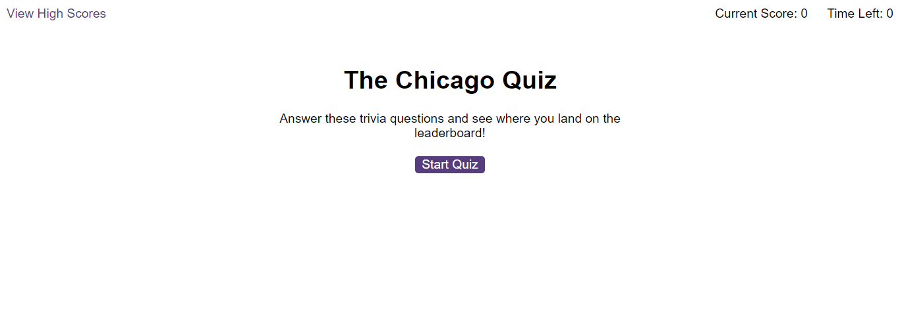
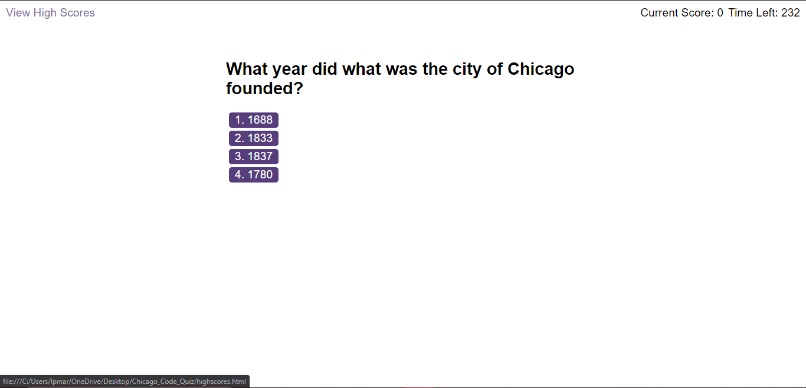
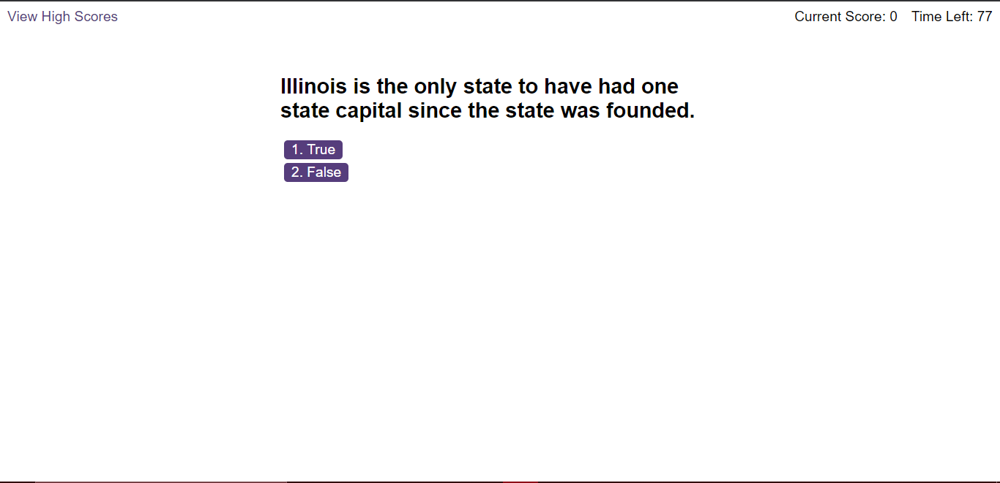
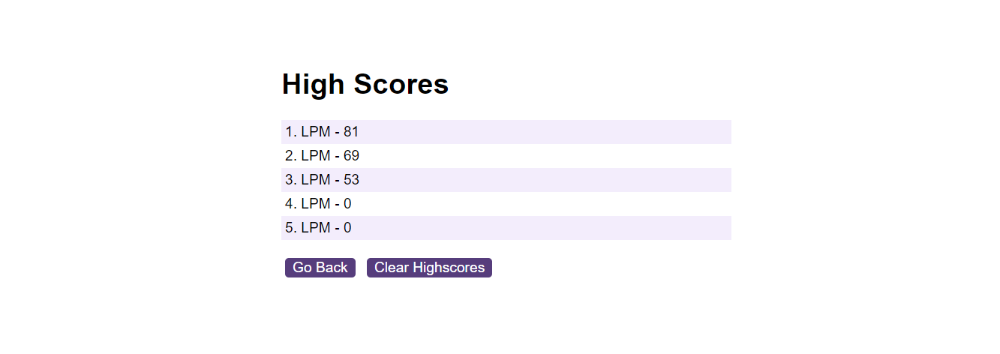

# Chicago_Facts_Quiz

# Description
This is the Chicago facts quiz. You can answer a number of questions all relating to different facts about Chicago and Illinois in a timed quiz format. Users are given a number of answer selections and with every wrong answer, time gets taken away. At the end, you can see where you place on the leaderboard

# How to Start

By following the link here: https://lpmartinez1109.github.io/Chicago_Code_Quiz/, you can take this timed quiz and see where you rank on the leaderboard.

# Starting Page Image

As shown in the image above, the user will have the option to start the quiz as well as view the high scores of any past player. The top right-hand corner will display how much time the user as to finish the quiz.

## Multiple Choice Question

## True and False Question

# Gameplay

Players will be asked a variety of different multiple and true-and-false questions regarding different aspect about Chicago and the state of Illinois. With every incorrect answers, the player will be deducted 15 seconds from their overall time.

# High Score

Since the quiz functions on the players local device, each high score board will look different than that pictured above. There is allow a button that will allow the player to clear the high score board.

# How To Play
Once on the landing page, click the start button and get ready to take the quiz. See where you ranked among players and try to reach the top spot on the leader board.

# Future Developments
The Chicago Code Quiz has a lot of potential for growth and development. Once of the future developments in the works is the ability for the user to see their current score while they are actually taking the quiz. While players can see their score at the end of the quiz, it would be nice to see how your score is being tallied and work on making their way up the leader board.

Another potential development is adding a feature allowing the user/player to select what type of quiz they would like to take. This will allow them to take a number of different quizes and then be able to see where they rank on multiple leaderboards. With this in mind, this development would also include work towards a global leaderboard were users/players can see their rank across every single quiz they have taken and who holds the top spot globally.